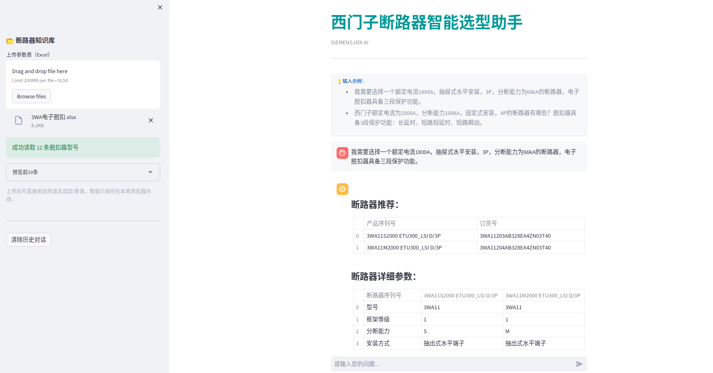

# 🔌 CircuitBreaker-Sizer · 西门子断路器智能选型助手

基于自然语言大模型（LLM）驱动的西门子 3WA 系列断路器选型助手，支持通过中文需求智能生成产品序列号、匹配脱扣器、订货号与技术参数，帮助用户快速查询西门子3WA断路器产品信息。

---

## 🚀 快速开始

### ✅ 环境配置

```bash
git clone https://github.com/YaoruLuo/circuitBreaker-Sizer.git
cd circuitBreaker-Sizer
```

默认采用xinference推理框架（需自行安装），GLM4-Chat模型。

# 安装依赖（推荐使用虚拟环境）
```
pip install -r requirements.txt
```

---

### ▶️ 启动服务

```bash
streamlit run app.py
```

默认地址：[http://localhost:8501](http://localhost:8501)

---

## 💡 功能介绍

| 功能           | 描述                               |
| ------------ | -------------------------------- |
| 🗣️ 中文自然语言输入 | 输入“我要额定电流2500A，4极，抽屉式”，自动解析需求    |
| 🤖 LLM参数解析   | 基于 Prompt Template 提取断路器参数和脱扣器参数 |
| 🧩 脱扣器筛选匹配   | 支持上传脱扣器 Excel 表，字段自动匹配和最优筛选      |
| 📦 产品序列号推荐   | 自动生成完整产品序列号，匹配订货号                |
| 📄 参数查询      | 查询产品型号所对应的技术参数，展示为结构化表格          |

---

## ⚙️ 模型配置

支持通过 API 调用本地或远程模型（兼容 OpenAI 接口）。

配置位于 `config/config.py`：

```python
LLM_CFG = {
    "model_name": "glm4-chat",
    "xinference_url": "http://localhost:9997/v1/chat/completions",
    "max_tokens_breaker": 1024,
    "max_tokens_trip": 1024,
}
```

---

## 📸 展示截图

> 以下为部分实际使用截图（用户输入 → 推荐型号 → 技术参数）：
> 


| 自然语言输入   | 推荐产品序列号   | 技术参数展示   |
| -------- | --------- | -------- |
| ✅ 支持模糊匹配 | ✅ 多型号自动推荐 | ✅ 自动提取表头 |

---

## 👨‍💻 维护者 Maintainer

**Luo Yao Ru**
[GitHub](https://github.com/YaoruLuo) · [Email](yao-ru.luo@siemens.com)

---

> 欢迎 star ⭐️ & fork 🍴 ，一起探索工业智能选型的新范式。


